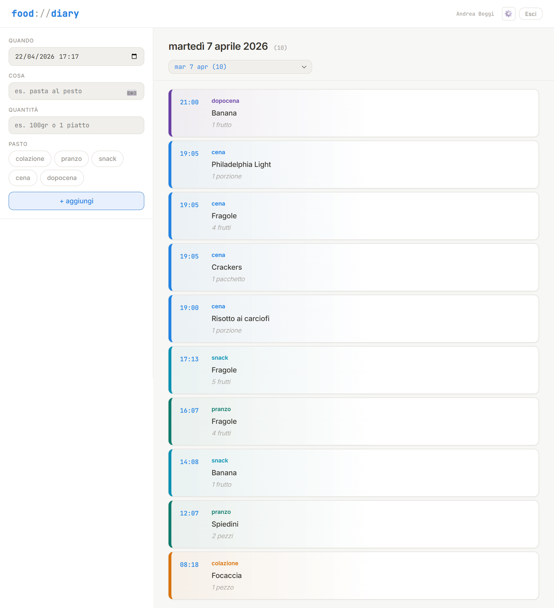

# Food Diary

Web app multi-utente per tracciare i pasti giornalieri, ottimizzata per uso desktop e mobile.


- **Backend**: FastAPI + SQLite
- **Autenticazione**: Firebase Authentication (Google Login)
- **Frontend**: HTML/CSS/JS (single page, light theme Notion-inspired, mobile-first)
- **Runtime**: `uvicorn` (systemd o Docker)
- **Porta di default**: `8080`
- **Docker Image**: `abeggi/food-diary:latest`

## Funzionalità

- **Multi-Utente con Controllo degli Accessi**: Accesso sicuro tramite Google Workspace/Gmail.
- **Whitelist System**: L'accesso effettivo all'app è ristretto solo agli account esplicitamente approvati dall'amministratore (Whitelist).
- **Access Denied Wall**: Gli utenti autenticati ma non autorizzati vengono reindirizzati a una schermata di blocco dedicata con le istruzioni per richiedere l'abilitazione.
- **Registrazione Pasti**: Inserimento voce con data/ora, categoria, cibo e quantità.
- **AI Food Scanner 📷**: Riconoscimento automatico del cibo tramite Google Gemini Vision (Funzionalità limitata al solo Amministratore).
- **Autocomplete Personale**: Suggerimenti intelligenti basati sullo storico privato dell'utente.
- **Area Impostazioni**: 
  - Esportazione dati (CSV/JSON) filtrata per utente.
  - Ricerca ed editing globale del proprio database.
- **Pannello Gestione Amministratore**: Sezione speciale per l'amministratore dove:
  - Gestire l'approvazione degli accessi (Abilita/Disabilita utenti in Whitelist).
  - Pre-autorizzare nuove email.
  - Eliminare definitivamente gli utenti e i relativi dati dal sistema.
- **PWA & Mobile Ready**: Installabile su smartphone con icona personalizzata.

## Installazione e Configurazione

L'app richiede ora la configurazione di Firebase per il sistema di autenticazione.

### 1. Configurazione Firebase (Backend)
1. Crea un progetto su [Firebase Console](https://console.firebase.google.com/).
2. Vai in **Project Settings** > **Service Accounts** e genera una nuova chiave privata JSON.
3. Incolla il contenuto del JSON nel file `.env`:
   ```env
   FIREBASE_SERVICE_ACCOUNT_JSON={"type": "service_account", ...}
   ADMIN_EMAIL=tua_email@gmail.com
   ```

### 2. Configurazione Firebase (Frontend)
1. In Firebase Console, aggiungi un'app Web al progetto.
2. Copia le credenziali nel file `static/firebase-config.js` (partendo da `static/firebase-config.js.example`):
   ```javascript
   const firebaseConfig = {
     apiKey: "...",
     authDomain: "...",
     // ...
   };
   ```

### 3. Configurazione AI (Gemini)
Inserisci la tua API Key di Google AI nel file `.env`:
```env
GEMINI_API_KEY=tua_chiave_qui
```

## Architettura

```
food-diary/
├── main.py              # API FastAPI, logica DB, Autenticazione Firebase
├── requirements.txt     # dipendenze (FastAPI, firebase-admin, uvicorn, etc.)
├── .env                 # Secret keys (Gemini, Firebase Service Account)
├── static/
│   ├── index.html       # App principale
│   ├── settings.html    # Gestione dati e Admin
│   └── firebase-config.js # Configurazione client Firebase (Ignorato da Git)
├── data/                # Database SQLite (user-aware)
└── migrate_user.py      # Script per migrare dati locali a un account Google
```

## Gestione Amministratore & Whitelist

L'utente specificato in `ADMIN_EMAIL` nel file `.env` ha i privilegi massimi (e non può mai essere rimosso o bloccato dal sistema). 
Nelle **Impostazioni**, l'admin ha accesso a un pannello integrato per:
- **Gestire gli Accessi**: Abilitare (aggiungere alla whitelist) o bloccare (rimuovere dalla whitelist) qualsiasi utente registrato con un semplice click.
- **Pre-autorizzare**: Inserire un'email in anticipo, in modo che l'utente possa accedere immediatamente al primo login senza incontrare il blocco di sicurezza.
- **Eliminazione Dati**: Eliminare definitivamente un utente e formattare tutti i dati (voci e suggerimenti) da esso generati.

*Nota:* Per ragioni di sicurezza e contenimento dei costi API, il modulo **AI Food Scanner** è disponibile esclusivamente per l'account Amministratore.

## Sicurezza

L'applicazione è stata sottoposta a un audit di sicurezza completo. Le seguenti misure sono attive:

- **Fail-Closed Architecture**: Se Firebase non è configurato correttamente, l'applicazione **rifiuta di avviarsi** in produzione. Nessun bypass silenzioso.
- **DEV_MODE Esplicito**: Le modalità di sviluppo (utente mock, auth disattivata) sono accessibili **solo** impostando `DEV_MODE=true` come variabile d'ambiente. Il default è `false`.
- **Rate Limiting**: Tutti gli endpoint sensibili sono protetti con `slowapi`:
  - Auth (`/api/me`): 30 req/min
  - Admin: 10 req/min
  - Scrittura: 20 req/min
  - AI Scanner: 5 req/min
- **Token Auto-Refresh**: I token Firebase vengono rinnovati automaticamente in background tramite `onIdTokenChanged`, prevenendo errori 401 dopo 60 minuti.
- **Credenziali In-Memory**: Il Service Account JSON viene caricato direttamente in memoria (`json.loads`), senza mai scrivere file temporanei su disco.
- **Nessun Secret nel Codice**: `ADMIN_EMAIL`, `FIREBASE_SERVICE_ACCOUNT_JSON` e `GEMINI_API_KEY` sono obbligatori come variabili d'ambiente. Nessun valore di default è presente nel codice sorgente.
- **Git Safety**: `.gitignore` esclude `*.db`, `*.db-shm`, `*.db-wal`, `.env`, `firebase-config.js` e `migrate_user.py`.

Per lo sviluppo locale, è disponibile un file `static/firebase-config.js.example` come template.

## Deploy con Docker

```bash
docker run -d \
  --name food-diary \
  -p 8080:8080 \
  -v ./data:/app/data \
  -v ./static/firebase-config.js:/app/static/firebase-config.js:ro \
  -e ADMIN_EMAIL=tua_email@gmail.com \
  -e FIREBASE_SERVICE_ACCOUNT_JSON='{ ... }' \
  -e GEMINI_API_KEY=tua_chiave \
  abeggi/food-diary:latest
```

Oppure con `docker-compose`:
```bash
docker compose up -d
```
(Assicurarsi che `.env` e `static/firebase-config.js` siano presenti nella directory.)
