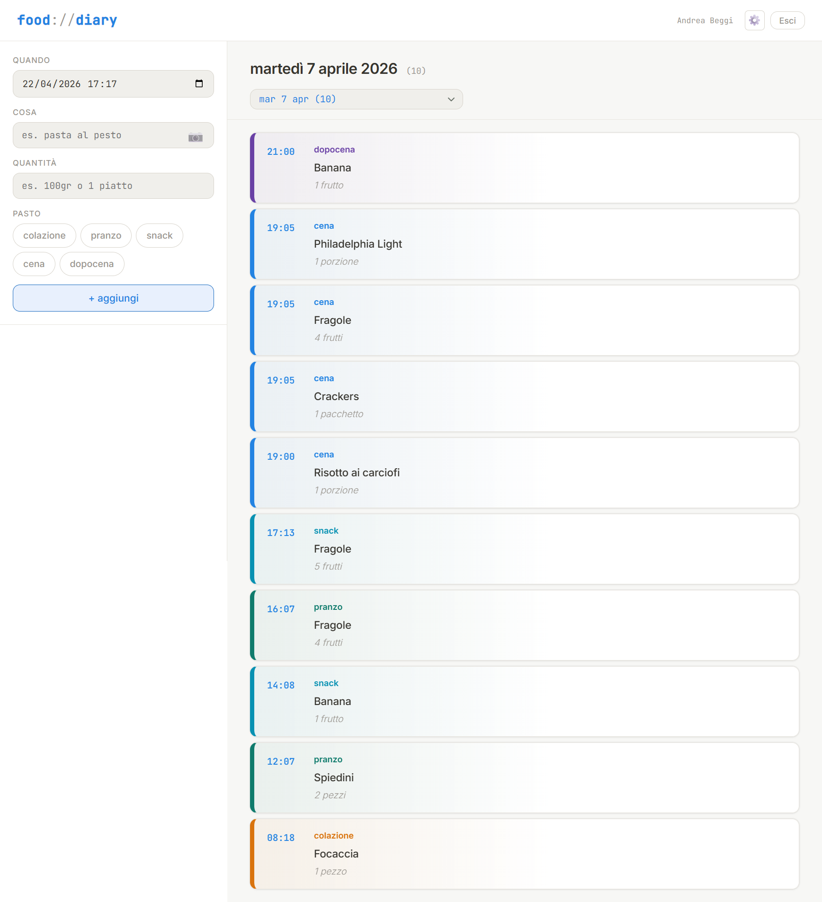

# Food Diary

Web app personale per tracciare i pasti giornalieri, ottimizzata per uso desktop e mobile.



- **Backend**: FastAPI + SQLite
- **Autenticazione**: gestita dal reverse proxy (singolo utente: `abeggi`)
- **Frontend**: HTML/CSS/JS (single page, light theme Notion-inspired, mobile-first)
- **Runtime**: `uvicorn` (systemd o Docker)
- **Porta di default**: `8080`
- **Docker Image**: `abeggi/food-diary:latest`

## Funzionalità

- **Registrazione Pasti**: Inserimento voce con data/ora, categoria, cibo e quantità.
- **AI Food Scanner 📷**: Riconoscimento automatico del cibo tramite Google Gemini Vision.
- **Autocomplete Personale**: Suggerimenti intelligenti basati sullo storico privato.
- **Area Impostazioni**: 
  - Esportazione dati (CSV/JSON).
  - Ricerca ed editing globale del database.
- **PWA & Mobile Ready**: Installabile su smartphone con icona personalizzata.

## Configurazione

### AI (Gemini) — opzionale
Inserisci la tua API Key di Google AI nel file `.env`:
```env
GEMINI_API_KEY=tua_chiave_qui
```

L'autenticazione è gestita esternamente dal reverse proxy. L'unico utente (`abeggi`) è sempre admin.

## Architettura

```
food-diary/
├── main.py              # API FastAPI, logica DB
├── requirements.txt     # dipendenze (FastAPI, uvicorn, etc.)
├── .env                 # GEMINI_API_KEY
├── static/
│   ├── index.html       # App principale
│   └── settings.html    # Gestione dati
├── data/                # Database SQLite
└── docs/                # Pagina informativa
```

## Sicurezza

- **Rate Limiting**: Tutti gli endpoint sono protetti con `slowapi`:
  - Admin: 10 req/min
  - Scrittura: 20 req/min
  - Lettura: 60 req/min
  - AI Scanner: 5 req/min
- **Git Safety**: `.gitignore` esclude `*.db`, `*.db-shm`, `*.db-wal` e `.env`.

## Deploy con Docker

```bash
docker run -d \
  --name food-diary \
  -p 8080:8080 \
  -v ./data:/app/data \
  -e GEMINI_API_KEY=tua_chiave \
  abeggi/food-diary:latest
```

Oppure con `docker-compose`:
```bash
docker compose up -d
```
(Assicurarsi che `.env` sia presente nella directory.)
